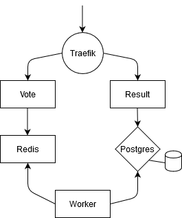

# Docker-Voting in Kubernetes
A practice Kubernetes workload that orchestrates the popular docker-compose example application.

Written with the intention that this would be an app used in production.

#### Author
Adrian Agnic [ [Github](https://github.com/ajagnic) ]

## Application Flow


#### Images and Resource Types
- [Traefik](https://hub.docker.com/_/traefik) - HTTP reverse-proxy (DaemonSet)
- [Postgres](https://hub.docker.com/_/postgres) - SQL database (StatefulSet)
- [Redis](https://hub.docker.com/_/redis) - Key-value data store (Deployment)
- [Vote](https://hub.docker.com/r/dockersamples/examplevotingapp_vote) - Python Flask web server (Deployment)
- [Worker](https://hub.docker.com/r/ajagnic/voting_fixed_worker) - Java process (modified version of the original [image](https://hub.docker.com/r/dockersamples/examplevotingapp_worker)) (Deployment)
- [Result](https://hub.docker.com/r/ajagnic/voting_fixed_result) - Node.js web server (modified version of the original [image](https://hub.docker.com/r/dockersamples/examplevotingapp_result)) (Deployment)

## Notes
- Ingress resource uses [nip.io](https://nip.io/) hostnames to simulate DNS resolution without modification of a _hosts_ file.

## Run
__Note__: This has only been tested as running on a local k8s cluster.

Create the IngressController before starting the application
```sh
kubectl apply -f ingress/traefik.yml
```

Create the application resources under the _voting_ namespace
```sh
kubectl apply -n voting -f .
```

Check that all resources were created successfully
```sh
kubectl get all -n ingress
```
```
NAME                READY   STATUS    RESTARTS   AGE
pod/traefik-95khw   1/1     Running   0          9s

NAME                    TYPE           CLUSTER-IP       EXTERNAL-IP   PORT(S)          AGE
service/traefik         LoadBalancer   10.109.124.169   localhost     80:31442/TCP     10s
service/traefik-admin   NodePort       10.106.11.156    <none>        8080:30582/TCP   9s

NAME                     DESIRED   CURRENT   READY   UP-TO-DATE   AVAILABLE   NODE SELECTOR   AGE
daemonset.apps/traefik   1         1         1       1            1           <none>          9s
```

```sh
kubectl get all -n voting
```
```
NAME                          READY   STATUS    RESTARTS   AGE
pod/postgres-0                1/1     Running   0          17s
pod/redis-648444b777-bb7jt    1/1     Running   0          17s
pod/redis-648444b777-w7smx    1/1     Running   0          17s
pod/result-787bbdb795-7dwx7   1/1     Running   0          16s
pod/result-787bbdb795-7lnqd   1/1     Running   0          16s
pod/result-787bbdb795-h7bx6   1/1     Running   0          16s
pod/vote-74567fc67f-cnvq9     1/1     Running   0          16s
pod/vote-74567fc67f-l5ctv     1/1     Running   0          16s
pod/vote-74567fc67f-prvzk     1/1     Running   0          16s
pod/worker-7bb7b9669f-2tpld   1/1     Running   0          16s
pod/worker-7bb7b9669f-6ctcj   1/1     Running   0          16s
pod/worker-7bb7b9669f-rjpq4   1/1     Running   0          16s
pod/worker-7bb7b9669f-wh4sr   1/1     Running   0          16s

NAME             TYPE        CLUSTER-IP       EXTERNAL-IP   PORT(S)    AGE
service/db       ClusterIP   10.97.4.218      <none>        5432/TCP   17s
service/redis    ClusterIP   10.110.217.73    <none>        6379/TCP   17s
service/result   ClusterIP   10.101.223.138   <none>        80/TCP     17s
service/vote     ClusterIP   10.111.43.177    <none>        80/TCP     16s

NAME                     READY   UP-TO-DATE   AVAILABLE   AGE
deployment.apps/redis    2/2     2            2           17s
deployment.apps/result   3/3     3            3           17s
deployment.apps/vote     3/3     3            3           16s
deployment.apps/worker   4/4     4            4           16s

NAME                                DESIRED   CURRENT   READY   AGE
replicaset.apps/redis-648444b777    2         2         2       17s
replicaset.apps/result-787bbdb795   3         3         3       16s
replicaset.apps/vote-74567fc67f     3         3         3       16s
replicaset.apps/worker-7bb7b9669f   4         4         4       16s

NAME                        READY   AGE
statefulset.apps/postgres   1/1     17s
```

## Use
__Local URLs :__
- Vote - `http://vote.127.0.0.1.nip.io`
- Result - `http://result.127.0.0.1.nip.io`
- Traefik Admin - `http://{CLUSTER-IP}:{NODE-PORT}`

## Incoming
- Adding LetsEncypt functionality to Traefik for HTTPS endpoints